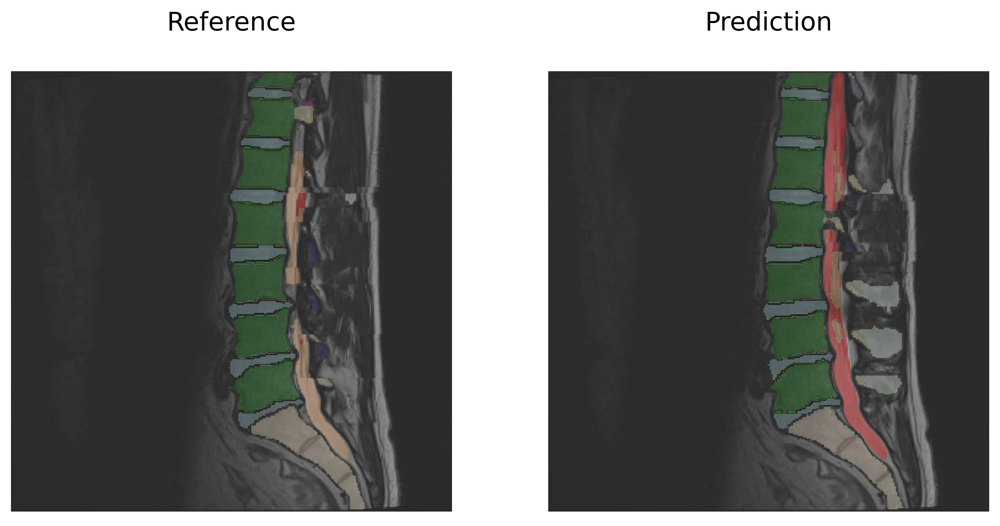
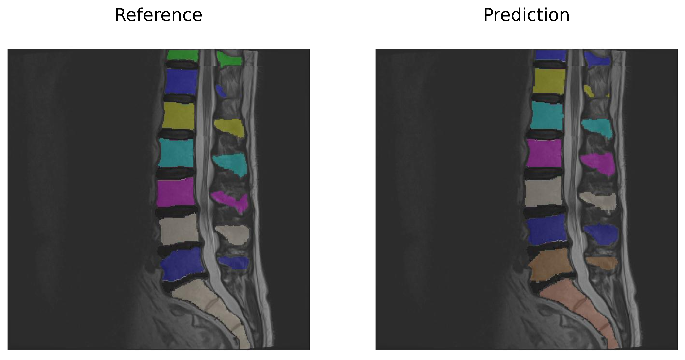
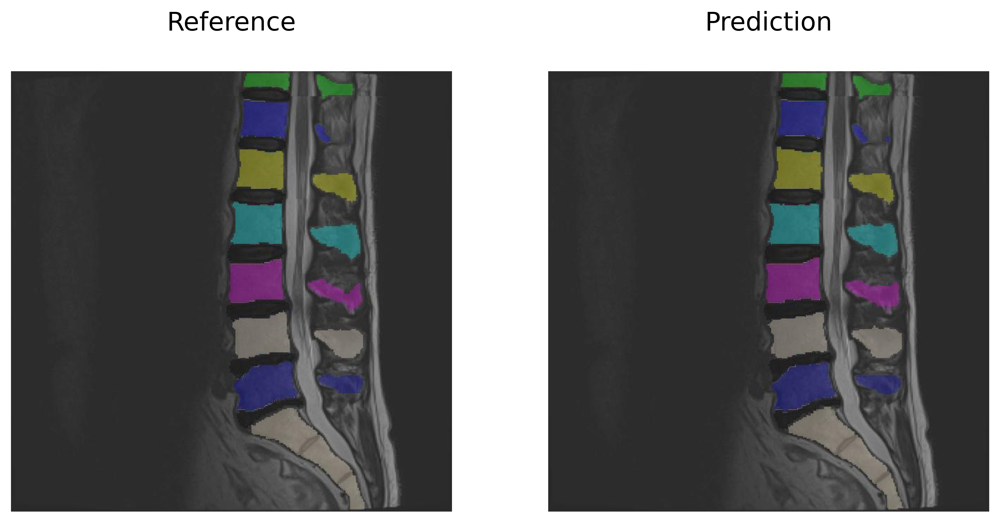

# Panoptica Tutorials

This folder contains several Jupyter notebooks to showcase different possible use cases of the [panoptica package](https://github.com/BrainLesion/panoptica).
The package allows to compute instance-wise segmentation quality metrics for 2D and 3D semantic- and instance segmentation maps by providing 3 core modules:

1. Instance Approximator
1. Instance Matcher
1. Panoptic Evaluator

## Use Case: Semantic Segmentation Input

Even though for many biomedical segmentation problems, an instance-wise evaluation is highly relevant and desirable, they are still addressed as semantic segmentation problems due to lack of appropriate instance labels.

Modules [1-3] can be used to obtain panoptic metrics of matched instances based on a semantic segmentation input.

[Juypter Notebook Example](example_spine_semantic.ipynb)

## Use Case: Unmatched Instances Input

It is a common issue that Instance segementation outputs have good segmentations with mismatched labels.

For this case Modules [2-3] can be utilized to match the instances and report panoptic metrics.

[Juypter Notebook Example](example_spine_unmatched_instance.ipynb)

## Use Case: Matched Instances Input

Ideally the input data already provides matched instances.

In this case Module 3 can be used to directly report panoptic metrics without requiring any internal preprocessing.

[Juypter Notebook Example](example_spine_matched_instance.ipynb)
